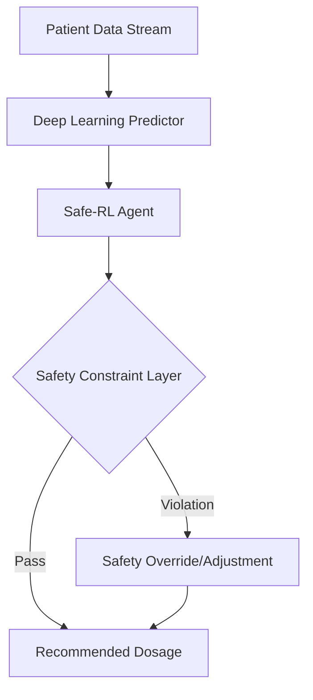

# SafeMedRL: Constrained Reinforcement Learning for Personalized Medical Dosage

> **Status:** Research Paper Under Review. Full source code restricted to peer-reviewers and academic collaborators.

## 📌 Project Overview
SafeMedRL is a research initiative focused on the application of **Constrained Reinforcement Learning** to optimize medical treatment dosages, specifically targeting **Type 1 Diabetes management**. The system utilizes a safety-critical agent to maintain glycemic levels within strict clinical bounds while optimizing for personalized patient response.

## 🚀 Key Features
*   **Safe-PPO Agent:** An implementation of RL techniques with a custom **Lagrangian safety layer** to prevent hypoglycemic events.
*   **LSTM-based Forecasting:** Integrated networks to predict physiological trends based on historical sensor data.
*   **Explainable AI (XAI):** A visualization module that maps RL decision pathways to clinical guidelines for physician trust.
*   **Bio-Sim Integration:** Validated against the Simglucose environment and clinical datasets.

## 🏗 System Architecture

## 📊 Visualizations & Results

*   **Safety Adherence:** Achieved a **98%+ safety threshold** across simulated cohorts.
*   **Accuracy:** Reduced Mean Absolute Error (MAE) in dosage prediction by **14%** compared to standard baseline controllers.

## 🛠 Tech Stack
*   **Language:** Python 3.10+
*   **Core Libraries:** PyTorch, Gymnasium, NumPy, Pandas
*   **Visualization:** Three.js, GSAP 
*   **Research Tools:** OSF, LaTeX

## 🔒 Access Policy
Due to the ongoing journal submission and the sensitive nature of clinical control logic, the core training scripts and unique safety constraints are currently in a **private repository**.

**For Professors and Admissions Committees:**
I am happy to provide temporary collaborator access or a live technical walkthrough. Please contact me at **sharmaishita1097@gmail.com** to request a deep-dive.
---
